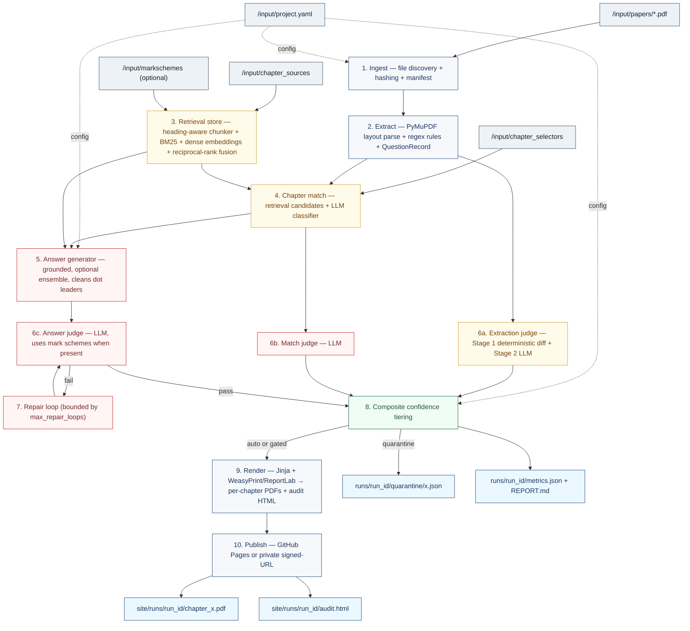
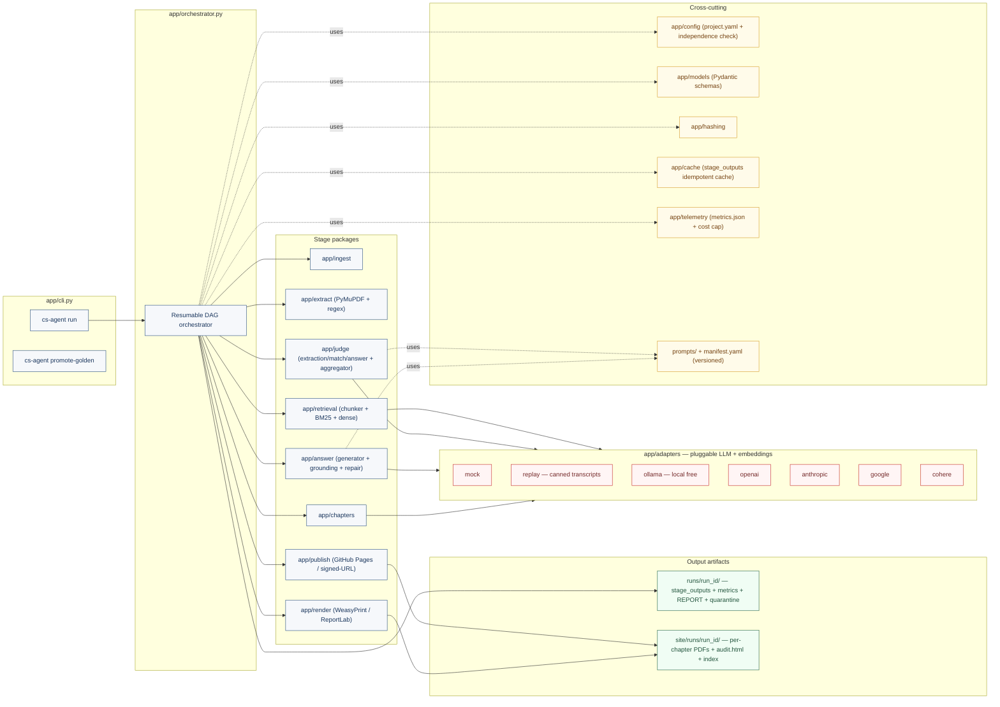

# cs-question-agent

A batch agent that processes computer-science question papers (PDFs) and publishes student-friendly worked-answer PDFs. Built as a **deterministic orchestration pipeline** with model-assisted steps — not one free-form autonomous agent.

- **Ingest** papers from a folder
- **Extract** questions verbatim with full numbering, marks, OR-branches, and code blocks preserved
- **Match** each question to a chapter using hybrid BM25 + dense retrieval + LLM classifier
- **Answer** in the voice of a 10th-grade teacher, grounded in chapter sources + mark schemes
- **Judge** with independent extraction, match, and answer judges (two-stage extraction judge; Stage 1 is deterministic)
- **Compose composite confidence** from ensemble agreement, grounding ratio, and retrieval strength (model self-reported confidence is audit-only)
- **Repair** low-confidence answers with a bounded retry loop
- **Render** one PDF per chapter + a master index + an audit HTML with reviewer actions
- **Publish** to GitHub Pages (public) or a private signed-URL target
- **Resumable DAG** — every stage is idempotent and skips cached outputs

Runs end-to-end with **zero API keys** using the built-in mock LLM adapter.

---

## Quickstart (no API keys required)

```bash
git clone https://github.com/deepakp1308/cs-question-agent.git
cd cs-question-agent

python -m venv .venv && source .venv/bin/activate
pip install -r requirements.txt

# Generate the sample paper used by tests and the demo.
python scripts/make_sample_paper.py

# Run the full pipeline end-to-end against example_input/.
python -m app.cli run --input example_input --run-id demo
```

You will get:

- `site/runs/demo/chapter_ch_computer_networks.pdf`
- `site/runs/demo/chapter_ch_databases.pdf`
- `site/runs/demo/index.html` — links to every chapter
- `site/runs/demo/audit.html` — QA report with sort/filter and per-row accept/reject/edit
- `runs/demo/metrics.json` — tokens, cost, latency, judge pass rates
- `runs/demo/REPORT.md` — human-readable summary
- `runs/demo/stage_outputs/` — every stage's per-question JSON

### Run the test suite

```bash
pip install pytest pytest-cov ruff
pytest -q
```

34 tests: unit + integration. The integration test runs the full pipeline against the sample paper and verifies artifacts + resumability.

---

## Architecture

The pipeline is a **deterministic resumable DAG** with model-assisted steps. Every stage is idempotent, writes a typed JSON record keyed by a stable id, and is skipped on subsequent runs if the input hash is unchanged.

### Pipeline flow



**Legend.** Blue = deterministic Python. Red = LLM call. Amber = hybrid (retrieval-backed LLM). Green = gate / decision.

### Component layout



### Resumable DAG contract

Every stage writes to `runs/<run_id>/stage_outputs/<stage>/<id>.json` with the hash of its inputs. On a repeat run the orchestrator skips any stage whose inputs are unchanged. Failures are captured in `runs/<run_id>/errors/<stage>/<id>.error.json` and never block unrelated questions.

---

## Configuration: `project.yaml`

See [example_input/project.yaml](./example_input/project.yaml) for the full, commented template. Key blocks:

```yaml
publish:
  github_pages_repo: "deepakp1308/cs-question-agent"
  visibility: "public"     # public | private

quality:
  min_extraction_score: 0.98
  min_answer_score: 0.90
  max_repair_loops: 2
  max_run_cost_usd: 25.00
  confidence_weights:
    ensemble_agreement: 0.40
    grounding_ratio:    0.35
    retrieval_strength: 0.25
  grounding_ratio_floor: 0.70

runtime:
  concurrency: 4
  enable_ensemble: true

models:
  classifier:  { provider: "mock", model: "mock-classifier" }
  generator:   { provider: "mock", model: "mock-generator" }
  judge:       { provider: "mock", model: "mock-judge" }    # MUST differ from generator when not mock
  embeddings:  { provider: "mock", model: "mock-embeddings" }
  reranker:    { provider: "mock", model: "mock-reranker" }
```

`judge.provider` is validated to be different from `generator.provider` whenever a real provider is used. Same-family judges share hallucination blind spots with the generator; independence is enforced at startup.

---

## LLM backends

The agent is backend-pluggable. Set the provider/model per role in `project.yaml`.

| Provider | Setup | Cost | Notes |
|---|---|---|---|
| `mock` | Nothing. Default. | Free | Deterministic, offline. Runs every test and the demo end-to-end. |
| `ollama` | `ollama pull llama3.1` (and/or `ollama pull nomic-embed-text` for embeddings) | Free | Fully local. Point at `OLLAMA_HOST` if not default. |
| `openai` | `export OPENAI_API_KEY=…` and `pip install openai` | Paid | `gpt-4o-mini` / `gpt-5` / etc. |
| `anthropic` | `export ANTHROPIC_API_KEY=…` and `pip install anthropic` | Paid | Claude family. |
| `google` | `export GOOGLE_API_KEY=…` and `pip install google-generativeai` | Paid | Gemini family. |
| `cohere` | `export COHERE_API_KEY=…` and `pip install cohere` | Paid | Strong for rerank + embeddings. |

Optional deps are listed in [requirements-optional.txt](./requirements-optional.txt) and as extras in `pyproject.toml`:

```bash
pip install -e ".[openai,anthropic,google,cohere,render]"
```

### Example: real backends

```yaml
models:
  classifier:  { provider: "google",    model: "gemini-1.5-flash" }
  generator:   { provider: "anthropic", model: "claude-3-5-sonnet-latest" }
  judge:       { provider: "openai",    model: "gpt-4o" }   # different family from generator
  embeddings:  { provider: "openai",    model: "text-embedding-3-small" }
  reranker:    { provider: "cohere",    model: "rerank-3.5" }
```

---

## Input folder contract

```
/input
  /papers              # question papers (PDF, JPG, PNG)
  /chapter_selectors   # markdown listing chapters: either "# Title" or "ch_id: Title"
  /chapter_sources     # textbook chapters as .md / .txt
  /markschemes         # optional mark schemes (.md / .txt)
  project.yaml
```

Mark schemes are first-class: when present they are indexed into retrieval with `source_type: markscheme` and become the authoritative scoring rubric for the answer judge.

---

## CLI

```bash
# Full pipeline
python -m app.cli run --input ./input --run-id 2026-04-20-demo

# Restrict to one chapter / question / paper (repeatable)
python -m app.cli run --input ./input --run-id demo --only chapter=ch_networks

# Publish (writes published.json + prepares site/ for GitHub Pages deploy workflow)
python -m app.cli run --input ./input --run-id demo --publish

# Promote a reviewer-approved record into the golden set
python -m app.cli promote-golden --run-id demo --question-id <qid>
```

---

## Confidence policy

Tiers gate publishing. The composite score drives them; the model's self-reported confidence does not.

- `composite >= 0.95` → `auto_publish` (if all judges pass)
- `composite 0.85 – 0.94` → `gated_publish` (publish only if no judge flags a critical issue)
- `composite < 0.85` → `quarantine` (never auto-published; emitted as `runs/<run_id>/quarantine/<qid>.json` and flagged in the audit HTML)

Hard gates that force quarantine regardless of composite:

- any judge returns `pass: false`
- `grounding_ratio < quality.grounding_ratio_floor` (default 0.70)

---

## Data model highlights

`QuestionRecord` models the realities of exam papers:

- `or_group_id` + `variant_role` — OR branches (`Answer 3(a) OR 3(b)`)
- `duplicate_group_id` + `canonical_question_id` — exact-duplicate grouping
- `continuation_of` — subparts stitched across page breaks
- `diagram_crops` — rasterized bbox crops for the multimodal judge + render
- `code_blocks` — monospace spans preserved verbatim with indentation
- `acceptable_alternatives` — mark-scheme-derived variants for open-ended questions

Every output record records `models_used` and `prompt_versions` for reproducibility.

---

## GitHub Actions

Two workflows ship with the repo:

- `.github/workflows/ci.yml` — runs lint, unit + integration tests on Python 3.11 and 3.12, plus a demo pipeline smoke test; uploads `site/` and `REPORT.md` as artifacts on every push and PR.
- `.github/workflows/deploy.yml` — on push to `main`, runs the demo pipeline with `--publish` and deploys `site/` to GitHub Pages. Enable Pages in the repo settings and point the source to "GitHub Actions".

---

## Project layout

```
cs-question-agent/
  app/
    cli.py                  # click CLI: run, promote-golden
    orchestrator.py         # resumable DAG, telemetry, cost cap, per-stage caching
    config.py               # project.yaml loader + independence validation
    models.py               # Pydantic schemas (QuestionRecord, AnswerRecord, JudgeResult, ...)
    hashing.py              # stable content hashes + question_id derivation
    cache.py                # per-stage idempotent JSON cache
    telemetry.py            # metrics.json (tokens, cost, latency, judge pass rates)
    adapters/               # LLM + embedding backends: mock, ollama, openai, anthropic, google, cohere
    ingest/                 # file discovery + manifest
    extract/                # PyMuPDF layout parser + regex rules + question extractor
    chapters/               # selector parser + retrieval-grounded chapter matcher
    retrieval/              # heading-aware chunker + hybrid BM25/dense store
    answer/                 # generator + grounding + repair
    judge/                  # extraction (stage-1 diff + stage-2 LLM), match, answer judges
    render/                 # Jinja templates + WeasyPrint (ReportLab fallback)
    publish/                # GitHub Pages + private-visibility stub
  prompts/
    *.v1.txt                # versioned prompt templates
    manifest.yaml           # active version per prompt
  tests/
    unit/                   # ~30 focused tests
    integration/            # full-pipeline + resumability test
    goldens/                # expected/ and actual/ for shadow regression
  example_input/            # tiny but realistic fixtures
  scripts/make_sample_paper.py
  .github/workflows/        # CI + Pages deploy
```

---

## Non-negotiables (enforced in code)

1. Extracted `verbatim_text` is never paraphrased by the model (regex-first parser; LLM only resolves ambiguity).
2. Every record carries provenance: `source_file`, `page_range`, `bbox_refs`.
3. Answers must be grounded; the grounding ratio is a post-hoc deterministic measurement, not self-reported.
4. The judge runs on a different provider family from the generator whenever real backends are used.
5. `quality.max_run_cost_usd` is a hard cap — the orchestrator stops enqueueing LLM work when reached.
6. Quarantined records are excluded from the public student PDFs and marked `noindex` in the audit HTML.

---

## Roadmap

- `sqlite-vec` / `lancedb` dense index for large corpora
- Cross-encoder reranker wired into `retrieval.store` (currently fuses BM25 + dense only)
- Multimodal extraction judge that consumes `diagram_crops`
- Shadow-regression CI job wired to `tests/goldens/`
- Ghostscript compression pass on rendered PDFs

PRs welcome. The [full architecture spec](./docs/SPEC.md) is the source of truth when the code and the README disagree.

---

## License

MIT.
